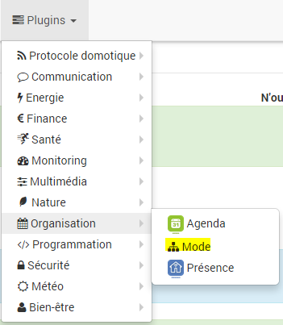

Plugin permettant de gérer différents modes d’un appartement mais aussi des ambiances.

Configuration du plugin
=======================

Après téléchargement du plugin, il vous suffit juste d’activer celui-ci, il n’y a aucune configuration à ce niveau.

Configuration des équipements
=============================

La configuration des équipements mode est accessible à partir du menu plugin :

Voilà à quoi ressemble la page du plugin mode (ici avec déjà 1 équipement) :

> **Tip**
>
> Comme à beaucoup d’endroits sur Jeedom, placer la souris tout à gauche permet de faire apparaître un menu d’accès rapide (vous pouvez, à partir de votre profil, le laisser toujours visible).

Une fois que vous cliquez sur l’un d’eux, vous obtenez :

Vous retrouvez ici toute la configuration de votre équipement :

-   **Nom de l'équipement Mode** : nom de votre équipement Mode,

-   **Objet parent** : indique l’objet parent auquel appartient l'équipement,

-   **Activer** : permet de rendre votre équipement actif,

-   **Visible** : rend votre équipement visible sur le dashboard,

-   **Catégorie** : les catégories de l'équipement (il peut appartenir à plusieurs catégories).

-   **Ajouter mode** : bouton permettant d’ajouter un nouveau mode

En-dessous vous retrouvez la liste des modes, en cliquant dessus vous allez pouvoir choisir les actions à faire lors de l’entrée dans ce mode et lors de la sortie :

